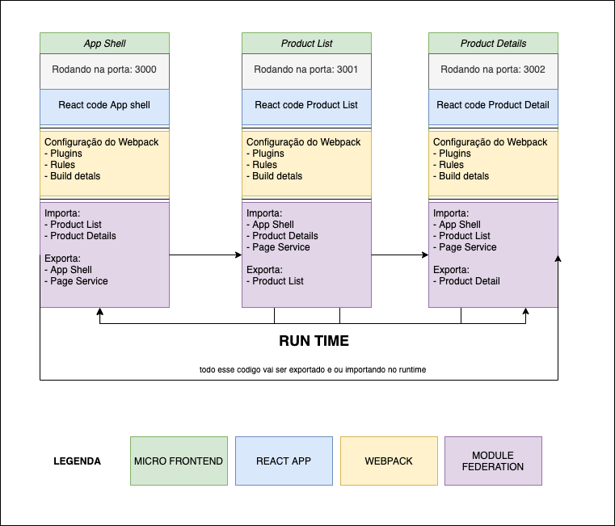

## Criando Micro-Front-Ends com Webpack5 Module Federation

Nesta lição, usaremos o plugin de module Federation do webpack
para criar nossos primeiros Micro-Front-Ends, O module federation é responsável por criar essa integração entre vários builds separados,
com ele, você poderá compartilhar seu código (componentes, lógica, serviços, etc ...) em tempo de execução 🤯, e ao mesmo tempo manter
seu processo de construção e desenvolvimento em paralelo.

com este exemplo, vamos criar 3 micro-front-ends com compartilhamento de código de forma bidirecional,
a ideia é de no final da dessa aula ter um modelo de e-commerce bem simples onde teremos
a mesma experiência sendo criada e compartilhada entre os nossos MFE's, compartilhando código em tempo de execução sem perda de desempenho.

## Aplicação Final 🎬


Observe aqui que estamos navegando em diferentes servidores, mas a experiência final
é o mesma, não importa em qual MFE você esteja.
está curioso para saber como vamos fazer isso? Então vamos lá codar !!!.

## Primeiros passos 🏁

Clone o repositório.

```sh
git clone git@github.com:rocketseat-experts-club/live-micro-frontends-module-federation-2021-03-18.git container
```

`cd` no diretório.

```sh
cd  container
```

Instale as dependências do diretório principal do projeto:

|**⚠️ usaremos yarn para gerenciar nossos pacotes**

```sh
yarn install
```

em seguida, entre no diretório dos nossos MFE's

```sh
cd  shared-routing
```

Instale as dependencias

```sh
yarn install
```

Inicie o servidor de desenvolvimento:

```sh
yarn  start
```

Com isso, você terá os aplicativos em execução em:

- [localhost:3000](http://localhost:3000/) (aplicativo host) - `shell`
- [localhost:3001](http://localhost:3001/) (aplicativo autônomo remoto) - `ProductList`
- [localhost:3002](http://localhost:3002/) (aplicativo autônomo remoto) - `ProductDetails`

Abra uma dessas portas no navegador de sua escolha e você estará pronto para integrar com o aplicativo inicial 🚀.

💡 **Dica profissional** use `shared-routing-final` como o guia de referência final, este arquivo contém o projeto final para você seguir.

## Estrutura do Projeto 🏗

Conforme descrito, criaremos uma estrutura MFE com hosts host bidirecionais
podemos ver aqui o gráfico de como nossos MFE's vão ser divididos



Na pasta `Container/shared-routing`, temos os nossos MFE's:

- `Shell`: **MFE** Onde vamos criar o nosso application shell
- `ProductList /`: **MFE** responsavel pela listagem de produtos
- `ProductDetails /`: **MFE** responsavel pelo detalhamento de produtos

```md
├── ProductDetails
│   ├── package.json
│   ├── public
│   ├── src
│   └── webpack.config.js
├── ProductList
│   ├── package.json
│   ├── public
│   ├── src
│   └── webpack.config.js
├── Shell
│   ├── package.json
│   ├── public
│   ├── src
│   └── webpack.config.js
├── package.json
└── yarn.lock
```

## Ferramentas Utilizadas 🧰

- [x] React como uma linguagem de IU
- [x] Webpack5 como module bundler
- [x] Prettier como formatador de código
- [x] Lerna para gerenciar o monorepo
- [x] TailwindCss UI como nosso kit de ferramentas de design

## Expert

| [](https://github.com/vitormalencar) |
| :-----------------------------------------------------------------------------------------------------------------------------------------------------------------: |
|                                                          [Vitor Alencar](https://github.com/vitormalencar)                                                          |

## Licença

Projetado com ♥ por [vitormalencar](https://vitormalencar.com). Licenciado sob a [Licença MIT](licença).
