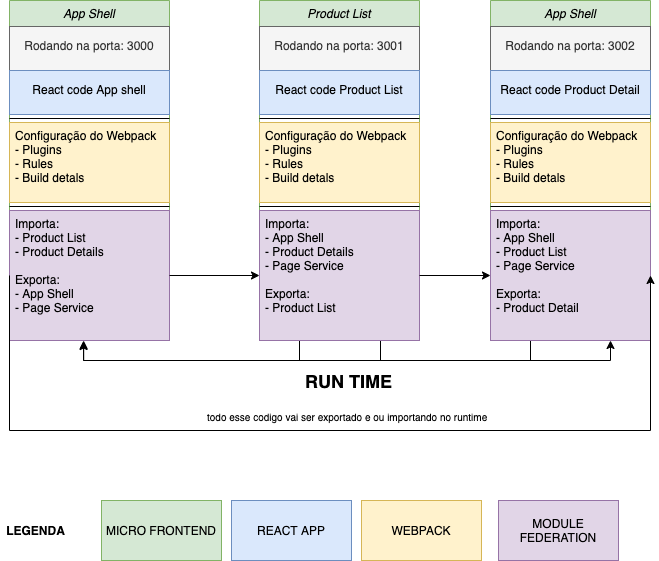

## Criando Micro-Front-Ends com Webpack5 Module Federation

Nesta aula, criaremos vamos utilizar o plugin module federation do webpack
para criar nosso primeiro Micro-Front-Ends, O Module federeation é responsavel por criar essa integração de mutiplos builds separados
com ele voce vai poder criar seus MFE compartilhando codigo (componentes, logica, serices, etc..) em run time 🤯, e ao mesmo tempo manter
seu processo de build deployment e desenvolvimento idenpendentes.

com esse exemplo vamos criar 3 micro-front-ends compartilhando codigo de forma bidirecional,
a ideia e ao final da aula ter um modelo bem simples de e-commerce onde vamos ter
com a mesma experiencia sendo criada em todos os nossos MFE, sem perca de performance, compartilhando codigo e atualizando em runtime.

e nesses exemplos eu vou estar utilizando tambem lerna para ajudar com o esquema de mono-repo =)


## Aplicação Final


Note aqui que estamos navegando por servers diferentes mas a experiencia final
é a mesma não importa em qual MFE você esteja. ta curioso como vamos fazer isso ?
então vamos la !!!.


## Primeiros passos 🏁

Clone o repositório.

```sh
git clone [TODO]
```

`cd` no diretório.

```sh
cd  [TODO]
```

Instale as dependências do projeto:

```sh
npm install
```

Inicie o servidor de desenvolvimento:

```sh
npm run start
```

Finalmente, vá para [localhost: 3000](http://localhost:3000) no navegador de sua escolha e você está pronto para integagir com a aplicação inicial 🚀.
note que as portas 3001 e 3002 tambem vão estar rodando as nossas aplicações

💡 **Dica profissional** use o `Container Final` como guia de referência final, este arquivo contém o projeto final para que você possa acompanhar.

## Ferramentas 🧰

- [x] React como uma linguagem de IU
- [x] Webpack5 como module bundler
- [x] Prettier como formatador de código
- [x] Lerna para gerenciar o monorepo
- [x] TailwindCss UI como nosso kit de ferramentas de design

## Estrutura do Projeto 🏗

Como descrito vamos criar uma estrutura de MFE bi-direcional
podemos ver aqui o grafico de como os nossos MFE vão ser divididos



Na pasta `Container/shared-routing`, temos os nossos MFE's:

- `shell`: **MFE** Onde vamos criar o nosso application shell
- `list /`: **MFE** responsavel pela listagem de Produtos
- `order /`: **MFE** responsavel pelo detalhamento de Produtos


## Expert

| [](https://github.com/vitormalencar) |
| :-----------------------------------------------------------------------------------------------------------------------------------------------------------------: |
|                                                          [Vitor Alencar](https://github.com/vitormalencar)                                                          |

## Licença

Projetado com ♥ por [vitormalencar](https://vitormalencar.com). Licenciado sob a [Licença MIT](licença).
